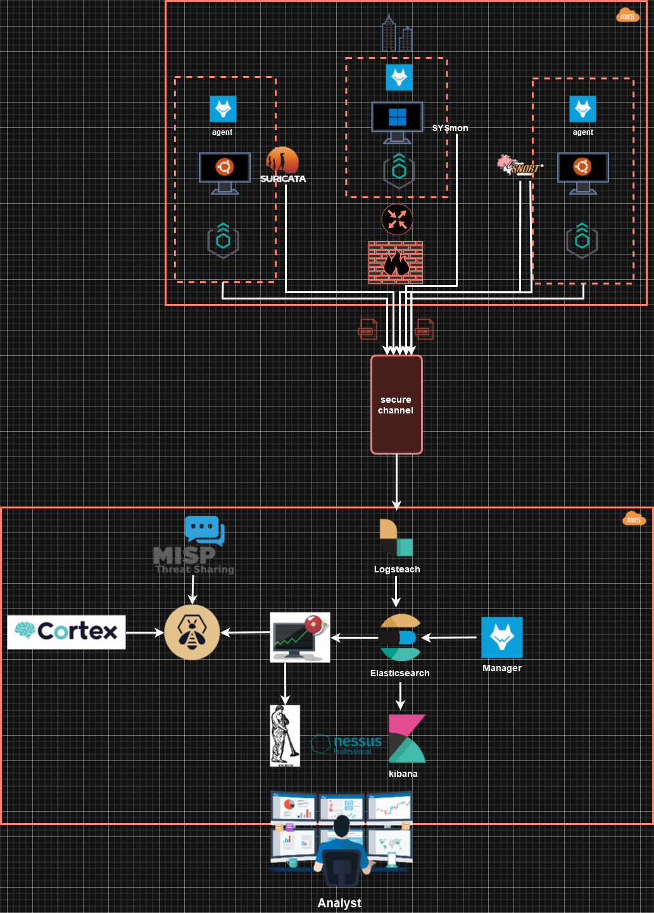
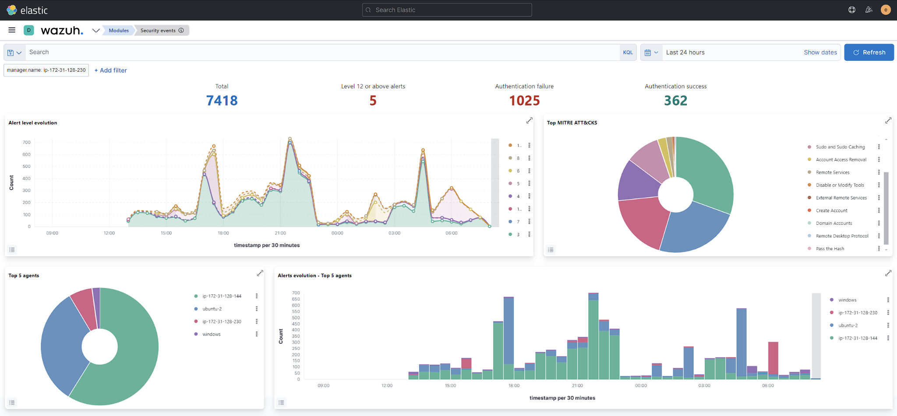
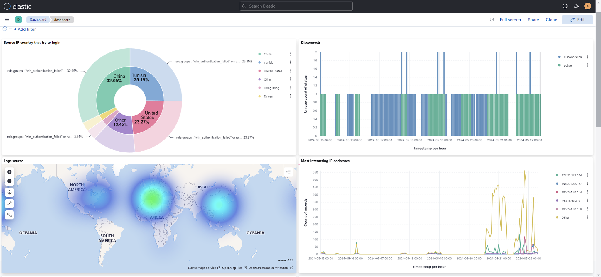
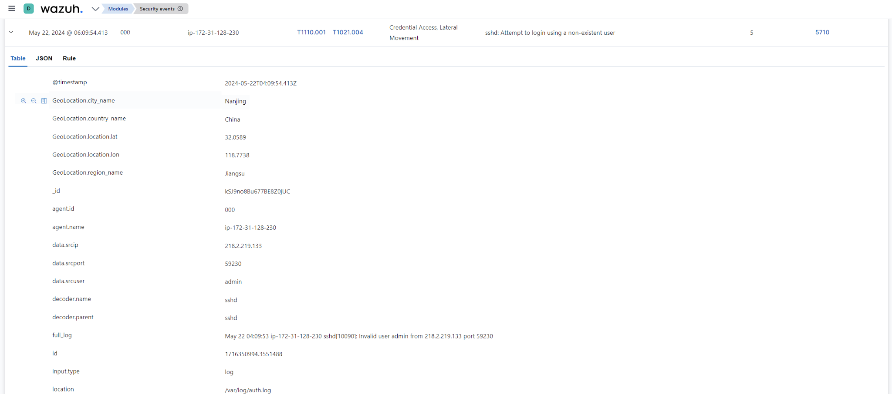

# 🔐 OpenSource-SocaaS
## Open-Source Security Operations Center as a Service (SOCaaS)

---

## 🏗️ Architecture Overview

OpenSource-SocaaS is built on a **cloud-native SOCaaS architecture** deployed on **AWS EC2**.  
The architecture integrates **SIEM, IDS/IPS, Vulnerability Management, Threat Intelligence, and Incident Response** using open-source tools.

### Architecture Components

#### 🔹 Servers
- **SOC Core Server**
  - Elasticsearch (Log indexing & correlation)
  - Kibana (Dashboards & visualization)
  - Wazuh (HIDS / XDR)
  - Filebeat & Elastic Agent
  - Praeco & ElastAlert (Alerting)
  - Nessus (Vulnerability Scanning)

- **Threat Intelligence & SOAR Server**
  - MISP (Threat Intelligence Sharing)
  - TheHive (Incident & Case Management)
  - Cortex (Observable analysis & enrichment)

- **Fleet Server**
  - Centralized Elastic Agent management

#### 🔹 Clients (Monitored Endpoints)
- Ubuntu Linux servers
- Windows server
- Web applications (Apache / IIS)
- Network IDS (Snort, Suricata)
- Sysmon for Windows telemetry

### SOC Workflow
1. Endpoints generate logs and events
2. Elastic Agents & Wazuh Agents collect telemetry
3. Elasticsearch indexes security data
4. Wazuh, Snort, and Suricata detect threats
5. Alerts are triggered via Praeco & ElastAlert
6. Incidents are created and managed in TheHive
7. Cortex enriches events using MISP
8. Nessus performs vulnerability scans

---

## 🖼️ Screenshots – Proof of Work

### 🔹 Wazuh Agent Management
*Active monitoring of Windows and Linux endpoints with full agent coverage.*

---

### 🔹 Security Events & Threat Detection
*Real-time security events, alert levels, authentication failures, and MITRE ATT&CK mapping.*

---

### 🔹 Security Monitoring & Threat Visibility (Elastic)

*Real-time visualization of security events collected from monitored endpoints.*

This dashboard highlights:
- **Source IP countries attempting authentication**
- **Global attack distribution (Geo map)**
- **Most interacting IP addresses**
- **Authentication failures and abnormal activity patterns**

---

### 🔹 Alert Investigation & Log Details
*Detailed alert view showing SSH brute-force attempts with geolocation and MITRE techniques.*

---

### 🔹 Real-Time Alerting & Incident Notification (Slack)

*Critical security alerts forwarded instantly to the SOC communication channel.*

- Alerts triggered by high-severity Wazuh rules
- Immediate visibility for SOC analysts
- Enables fast investigation and response

## 📖 Description

OpenSource-SocaaS is a cloud-based **Security Operations Center as a Service (SOCaaS)** built entirely using **open-source security tools** and deployed on **AWS**.

It provides:
- Centralized security monitoring
- Threat detection and alerting
- Incident response and investigation
- Threat intelligence enrichment
- Vulnerability assessment

The project demonstrates how organizations can build a **modern SOC architecture without proprietary tools**.

---

## 🎯 Objectives
- Design a secure and scalable SOC architecture
- Centralize security logs and events
- Detect threats using HIDS, NIDS, and SIEM
- Automate alerting and incident response
- Integrate threat intelligence and vulnerability scanning
- Leverage cloud infrastructure (AWS)

---

## 🔄 SOC Workflow Summary
1. Log and event collection via Elastic Agents and Wazuh
2. Threat detection using Wazuh, Snort, and Suricata
3. Event correlation and visualization in Elasticsearch and Kibana
4. Alerting through Praeco and ElastAlert (Email / Slack)
5. Incident management using TheHive
6. Threat enrichment using Cortex and MISP
7. Vulnerability scanning using Nessus

---

## 🛠️ Technologies Used

| Category | Tools |
|--------|-------|
| Cloud | AWS (EC2, VPC) |
| SIEM | Elasticsearch, Kibana |
| Endpoint Security | Wazuh |
| Log Collection | Filebeat, Elastic Agent |
| IDS / IPS | Snort, Suricata |
| Vulnerability Scanning | Nessus |
| Alerting | ElastAlert, Praeco |
| Threat Intelligence | MISP |
| Incident Response | TheHive |
| SOAR | Cortex |
| Notifications | Slack, Email |
